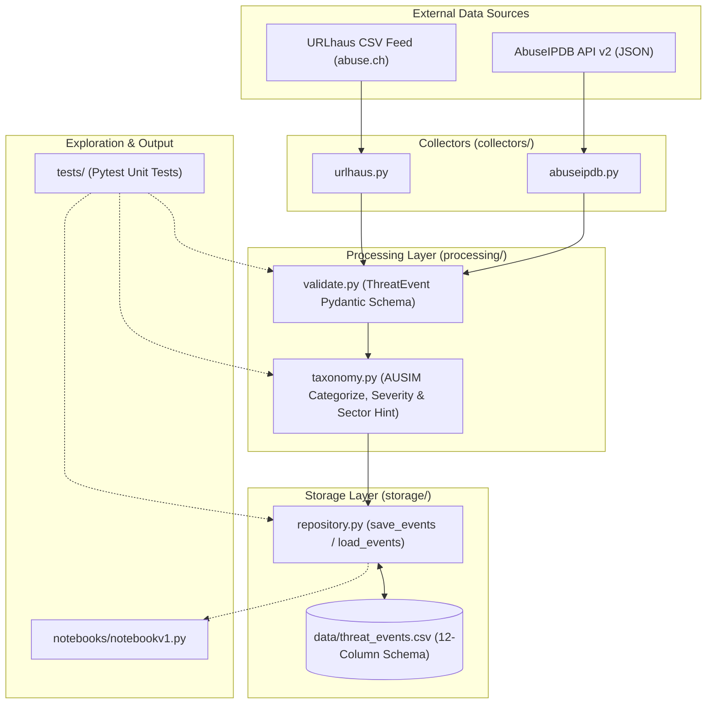

# Pull Request: Jalon 1 — Complete CTI Ingestion Pipeline, AUSIM Taxonomy & Storage Abstraction Layer

## 📌 PR Summary

This Pull Request delivers the complete **Jalon 1** implementation for **Plume (Observatoire des Cybermenaces pour PME Marocaines)**, a Cyber Threat Intelligence (CTI) observatory developed for the **CMRPI / EMC** internship (PFA 2026).

It establishes an end-to-end batch ingestion pipeline that fetches live threat indicators from public feeds (**URLhaus** and **AbuseIPDB**), validates them against a strict Pydantic schema, enriches them with the **AUSIM / CMRPI** taxonomy, deduplicates records, and persists them via a load-bearing storage repository abstraction.

---

## 🎯 Objectives Completed

- [x] **Primary Collector (`collectors/urlhaus.py`)**: Fetches and parses live CSV payload feeds from URLhaus (abuse.ch) with custom User-Agent headers.
- [x] **Secondary Collector (`collectors/abuseipdb.py`)**: Fetches JSON blacklists from AbuseIPDB API v2 with API key authentication from `.env`.
- [x] **Validation Layer (`processing/validate.py`)**: Implements strict `ThreatEvent` Pydantic schema enforcing type coercion, defaults, and error logging for invalid records.
- [x] **Taxonomy & Enrichment (`processing/taxonomy.py`)**:
  - Categorizes threats into 4 AUSIM framework categories (*Phishing*, *Ransomware / Malware*, *Attaques Web*, *DDoS*).
  - Buckets severity levels (*high*, *medium*, *low*).
  - Infers sector hints (`banking`, `ecommerce`, `government`, `education`, `unknown`).
- [x] **Storage Abstraction (`storage/repository.py`)**: Implements `save_events()` and `load_events()` with 3-tuple deduplication `(indicator_value, source, date_added)`.
- [x] **Data Quality & Exploration (`notebooks/`)**: Interactive Jupyter notebook and script visualizing dataset breakdown across 15,697+ threat events.
- [x] **Unit Testing (`tests/`)**: 9/9 passing pytest unit tests covering storage, validation, and taxonomy enrichment.
- [x] **Bilingual Documentation (`README.md`)**: Full French 🇫🇷 and English 🇬🇧 setup, execution, testing, and architecture guides.

---

## 🏗 Architectural Overview & System Flow



---

## 💾 12-Column Data Schema Specification

Every record saved to `data/threat_events.csv` strictly conforms to the 12-column `ThreatEvent` model:

| Column | Type | Description |
| :--- | :--- | :--- |
| `event_id` | `str` | Unique event identifier (URLhaus ID or AbuseIPDB IP hash). |
| `source` | `str` | Data source (`urlhaus`, `abuseipdb`). |
| `date_added` | `datetime` | Ingestion timestamp (ISO 8601 string format). |
| `indicator_type` | `Literal["url", "ip"]` | Type of threat indicator. |
| `indicator_value` | `str` | Actual URL or IP address. |
| `raw_threat_tag` | `str` | Original raw threat label from source feed. |
| `tags` | `str` | Raw tags string associated with the indicator. |
| `country_code` | `str` | ISO 2-letter country code (`MA`, `US`, etc.) or `""`. |
| `status` | `Literal["online", "offline", "reported"]` | Active status of the threat indicator. |
| `category` | `str` | AUSIM category (*Phishing*, *Ransomware / Malware*, *Attaques Web*, *DDoS*). |
| `severity` | `str` | Calculated threat level (*high*, *medium*, *low*). |
| `sector_hint` | `str` | Inferred target sector (`banking`, `ecommerce`, `government`, `education`, `unknown`). |

---

## 📊 Data Quality & Completeness Audit

Audit conducted on **15,697 processed threat events**:

- **Core Schema Completeness (100%)**: All 9 mandatory fields (`event_id`, `source`, `date_added`, `indicator_type`, `indicator_value`, `raw_threat_tag`, `status`, `category`, `severity`) contain non-null values across 100% of records.
- **Optional Tags Field (92.81%)**: Absent in 1,129 URLhaus records that were submitted without tags by feed reporters.
- **Geolocation (`country_code`)**: Populated for AbuseIPDB IP feeds (1.3% of total dataset). URLhaus hostnames do not include IP geolocation at ingestion time.
- **Sectoral Inference (`sector_hint`)**: 49 events matched specific sector patterns (`.gov.ma`, `banking`, `ecommerce`), with the remainder defaulting safely to `unknown`.

---

## 🧪 Verification & Testing

### Unit Test Execution
All 9 unit tests pass cleanly:

```bash
python -m pytest -v
```

```text
tests/test_repository.py::test_save_events_creates_file_with_correct_header PASSED
tests/test_repository.py::test_save_events_deduplication PASSED
tests/test_repository.py::test_load_events_on_missing_file PASSED
tests/test_taxonomy.py::test_row_with_phishing_tag_categorizes_as_phishing PASSED
tests/test_taxonomy.py::test_urlhaus_row_no_keyword_match_defaults_to_ransomware_malware PASSED
tests/test_taxonomy.py::test_abuseipdb_row_no_keyword_match_defaults_to_ddos_extortion PASSED
tests/test_validate.py::test_well_formed_row_passes_validation PASSED
tests/test_validate.py::test_row_missing_indicator_value_is_dropped PASSED
tests/test_validate.py::test_validate_rows_on_empty_dataframe PASSED

============================== 9 passed in 2.32s ==============================
```

### Manual Verification Steps
1. **URLhaus Collector Pipeline**:
   ```powershell
   python collectors/urlhaus.py
   ```
   *Verified*: Successfully downloads live feed, validates rows, enriches taxonomy, and appends to `data/threat_events.csv`.

2. **AbuseIPDB Collector Pipeline**:
   ```powershell
   python collectors/abuseipdb.py
   ```
   *Verified*: Safely checks `.env` for `ABUSEIPDB_API_KEY`, fetches top malicious IPs, and updates dataset.

3. **Data Deduplication**:
   *Verified*: Running collectors multiple times retains unique records based on `(indicator_value, source, date_added)` key.

---

## 📄 Key Files Added/Modified

- `collectors/urlhaus.py` — Ingestion pipeline for URLhaus CSV feed.
- `collectors/abuseipdb.py` — Ingestion pipeline for AbuseIPDB API.
- `processing/validate.py` — Pydantic schema validation & error dropping.
- `processing/taxonomy.py` — Keyword classification & severity rules.
- `storage/repository.py` — CSV abstraction repository.
- `notebooks/notebookv1.py` — Data exploration script.
- `tests/` — Test suites for repository, taxonomy, and validation.
- `README.md` — Comprehensive bilingual documentation (FR/EN).
- `.gitignore` & `repomix.config.json` — Git & Repomix pattern management.

---

## 🚀 Next Steps (Jalon 2 Preview)

1. Implement statistical aggregation functions in `analytics/stats.py`.
2. Add automated scheduling for periodic collector execution.
3. Prepare data feeds for Streamlit dashboard integration (`app.py`).
