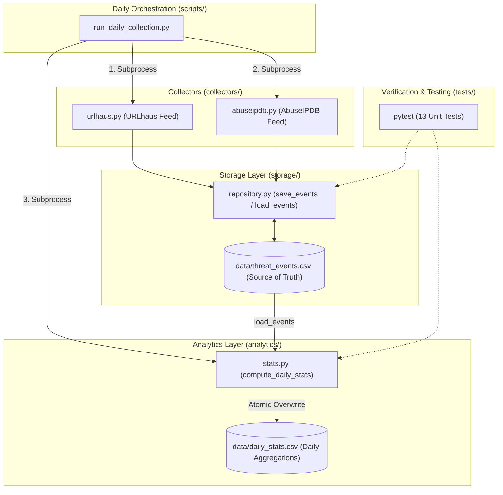

# Pull Request: Jalon 2 — Repeated Collection, Statistical Aggregation Engine & Multi-Day History

## 📌 PR Summary

This Pull Request delivers the complete **Jalon 2** implementation for **Plume (Observatoire des Cybermenaces pour PME Marocaines)**, a Cyber Threat Intelligence (CTI) observatory developed for the **CMRPI / EMC** internship (PFA 2026).

It transitions the project from single-run ingestion to an automated multi-day threat intelligence pipeline. It introduces a master daily runner script (`scripts/run_daily_collection.py`), implements the statistical aggregation engine (`analytics/stats.py` transitioning from stub to full production module), establishes continuous daily rollups (`data/daily_stats.csv`), resolves mixed-timezone date parsing bugs to guarantee 100% lossless accounting across all threat feeds, and expands unit testing coverage.

---

## 🎯 Objectives Completed

- [x] **Repeated Daily Collection Pipeline (`scripts/run_daily_collection.py`)**:
  - Orchestrates `collectors/urlhaus.py` and `collectors/abuseipdb.py` sequentially as isolated subprocesses using `sys.executable`.
  - Implements resilient error handling preventing collector failures (e.g., AbuseIPDB rate limits) from interrupting the overall pipeline.
  - Automatically triggers post-collection statistical aggregation (`analytics/stats.py`).
  - Strict standard-library implementation (`subprocess`, `sys`, `datetime`) without external dependencies.
- [x] **Statistical Rollup Engine (`analytics/stats.py`)**:
  - Replaces the Jalon 1 stub with a pure, testable aggregation function (`compute_daily_stats`).
  - Aggregates event history into canonical long-format daily stats (`date`, `category`, `count`).
  - Enforces atomic file overwrites on `data/daily_stats.csv` from the source of truth (`data/threat_events.csv`).
  - Implements strict failure handling with clean empty DataFrame behavior per AGENT.md policy.
- [x] **Bug Fix & Data Loss Prevention (Mixed-Timezone Datetime Parsing)**:
  - Identified and resolved a silent data loss issue in `pd.to_datetime` caused by mixed timestamp formats (naive URLhaus UTC vs. ISO `+00:00` AbuseIPDB timestamps).
  - Enforced `format="ISO8601", utc=True` conversion and added explicit console logging if invalid dates are ever encountered.
  - Fully restored **400+ AbuseIPDB events** in historical statistical aggregations.
- [x] **URLhaus Severity Refinement (`processing/taxonomy.py`)**:
  - Enhanced URLhaus severity derivation to support exact token matching, hyphenated families (`dropped-by-amadey`), and composite malware names (`PhantomStealer`, `Vidar`) while avoiding substring false positives (`demonstrates`).
- [x] **Unit Testing Suite Expansion (`tests/test_stats.py`, `tests/test_taxonomy.py`)**:
  - Added test cases validating statistical output schema, exact mathematical counts, and empty DataFrame edge cases.
  - Test coverage expanded to **13/13 passing pytest tests**.

---

## 🏗 Architectural Overview & System Flow



---

## 💾 Daily Stats Schema Specification (`data/daily_stats.csv`)

The aggregated daily statistics table strictly outputs long-format records:

| Column | Type | Description |
| :--- | :--- | :--- |
| `date` | `date` (YYYY-MM-DD) | Calendar day of threat ingestion (UTC). |
| `category` | `str` | Canonical AUSIM threat category (*ransomware_malware*, *ddos_extortion*, *phishing*, *web_attack*). |
| `count` | `int` | Exact count of unique threat events observed on that day for the category. |

---

## 📊 Data Quality & Historical Completeness Audit

Audit conducted on the active repository datasets:

- **Total Ingested Events (`data/threat_events.csv`)**: **26,793 events**
  - **URLhaus**: 26,293 events
  - **AbuseIPDB**: 500 events
- **Total Aggregated Events (`data/daily_stats.csv`)**: **26,793 events** (100.0% parity — zero dropped records)
- **Temporal Coverage**: **50 distinct calendar days** (from `2026-06-27` to `2026-08-15`)
- **Threat Category Distribution**:
  - `ransomware_malware`: **26,242** (97.94%)
  - `ddos_extortion`: **539** (2.01%)
  - `phishing`: **6** (0.02%)
  - `web_attack`: **6** (0.02%)
- **Severity Classification**:
  - `medium`: **11,727** | `high`: **1,131** | `low`: **756** | `unknown`: **13,179**

---

## 🧪 Verification & Testing

### Unit Test Execution
All 13 unit tests pass cleanly:

```bash
python -m pytest -v
```

```text
tests/test_repository.py::test_save_events_creates_file_with_correct_header PASSED [  7%]
tests/test_repository.py::test_save_events_deduplication PASSED          [ 15%]
tests/test_repository.py::test_load_events_on_missing_file PASSED        [ 23%]
tests/test_stats.py::test_compute_daily_stats_returns_correct_columns PASSED [ 30%]
tests/test_stats.py::test_compute_daily_stats_exact_counts PASSED        [ 38%]
tests/test_stats.py::test_compute_daily_stats_handles_empty_dataframe PASSED [ 46%]
tests/test_taxonomy.py::test_row_with_phishing_tag_categorizes_as_phishing PASSED [ 53%]
tests/test_taxonomy.py::test_urlhaus_row_no_keyword_match_defaults_to_ransomware_malware PASSED [ 61%]
tests/test_taxonomy.py::test_abuseipdb_row_no_keyword_match_defaults_to_ddos_extortion PASSED [ 69%]
tests/test_taxonomy.py::test_urlhaus_severity_mapping PASSED             [ 76%]
tests/test_validate.py::test_well_formed_row_passes_validation PASSED    [ 84%]
tests/test_validate.py::test_row_missing_indicator_value_is_dropped PASSED [ 92%]
tests/test_validate.py::test_validate_rows_on_empty_dataframe PASSED     [100%]

============================= 13 passed in 1.55s ==============================
```

### Manual Verification Steps
1. **Daily Orchestration Run**:
   ```powershell
   python scripts/run_daily_collection.py
   ```
   *Verified*: Sequentially runs URLhaus, AbuseIPDB, and stats computation with timestamped console logging.

2. **Standalone Stats Generation**:
   ```powershell
   python analytics/stats.py
   ```
   *Verified*: Generates and overwrites `data/daily_stats.csv`, reporting 26,793 total aggregated events across 50 days with zero parse errors.

3. **Lossless Accounting Verification**:
   *Verified*: `threat_events.csv` row count matches `daily_stats.csv` count sum exactly (`26,793 == 26,793`).

---

## 📄 Key Files Added/Modified

- `scripts/run_daily_collection.py` — **[NEW]** Automated daily collection and aggregation orchestrator.
- `analytics/stats.py` — **[MODIFIED]** Full production implementation of daily statistical aggregation engine and timezone-safe date parsing.
- `data/daily_stats.csv` — **[NEW]** Aggregated daily time-series dataset.
- `tests/test_stats.py` — **[NEW]** Unit test suite for statistics engine.
- `tests/test_taxonomy.py` — **[MODIFIED]** Added test coverage for URLhaus severity mapping.
- `processing/taxonomy.py` — **[MODIFIED]** Tokenized severity matching for composite and hyphenated malware tags.
- `AGENT.md` — **[MODIFIED]** Updated project focus, commands, and sequencing documentation.

---

## 🚫 Out of Scope for Jalon 2 (Deferred)

In accordance with `AGENT.md` constraints:
1. **DGSSI / CERT-MA Collector (`collectors/dgssi.py`)**: Remains a stub awaiting official coordination and data format confirmation from Dr. Al Marouni.
2. **NVD (`collectors/nvd.py`) & PhishTank (`collectors/phishtank.py`)**: Kept as stubs (back-burner backlog).
3. **Cross-Source Correlation (`analytics/correlate.py`)**: Scheduled for Jalon 3+.
4. **Interactive Dashboard (`app.py`) & Pilot Report (`reporting/rapport_pilote.py`)**: Primary deliverables for Jalon 3.

---

## 🚀 Next Steps (Jalon 3 Preview)

1. Build the Streamlit dashboard in `app.py` visualizing daily threat trends and sectoral vulnerability indicators.
2. Implement automated PDF / Markdown executive reporting in `reporting/rapport_pilote.py`.
3. Complete final user and architecture documentation.
