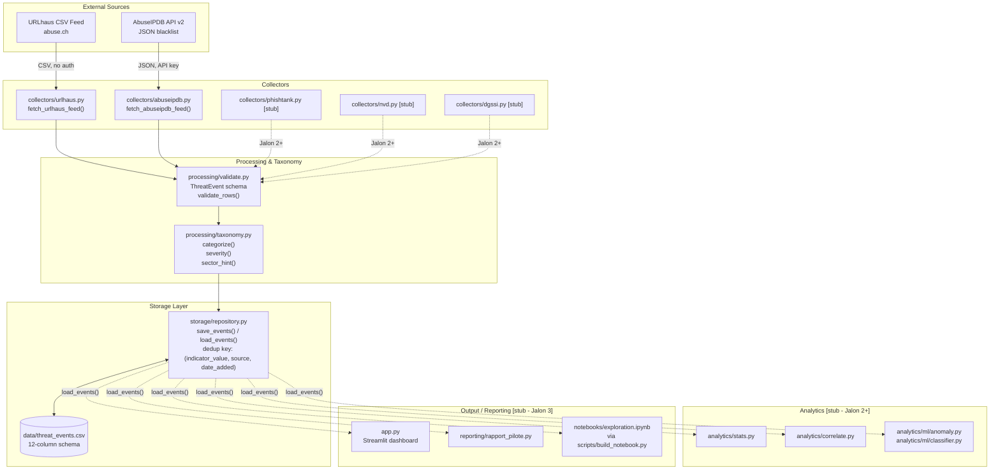
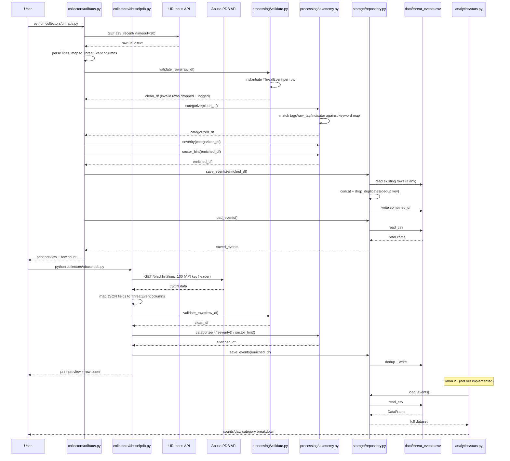
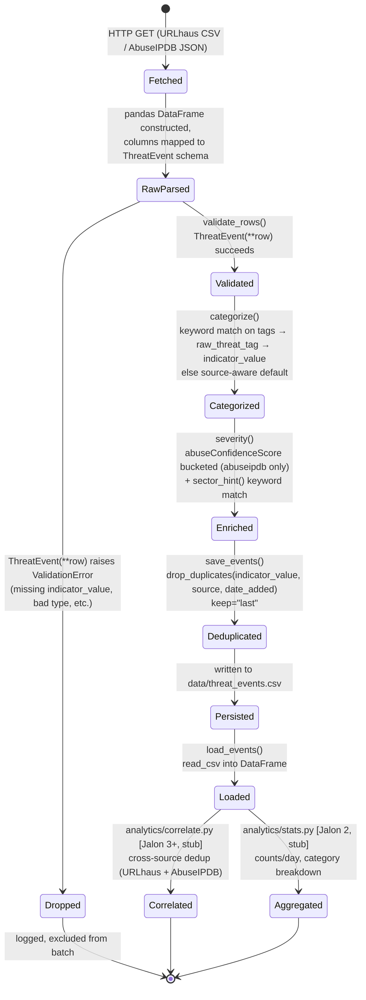

## 1. High-Level Data Architecture & Component Diagram

Every collector converges on `storage/repository.py` as the single gatekeeper for `data/threat_events.csv`, enforcing the project's load-bearing rule that no other module touches the CSV directly. Analytics and output modules are currently stubs that will only read from the repository via `load_events()` once later jalons are implemented.

## 2. End-to-End Execution Sequence Diagram

Both collectors follow an identical fetch → validate → categorize/enrich → save pipeline, converging on the same `save_events()` call that performs deduplication before writing to CSV. The `analytics/stats.py` step is shown as a stub interaction since it is not yet implemented per the AGENT.md jalon sequencing.

## 3. Core Data Processing State Diagram

