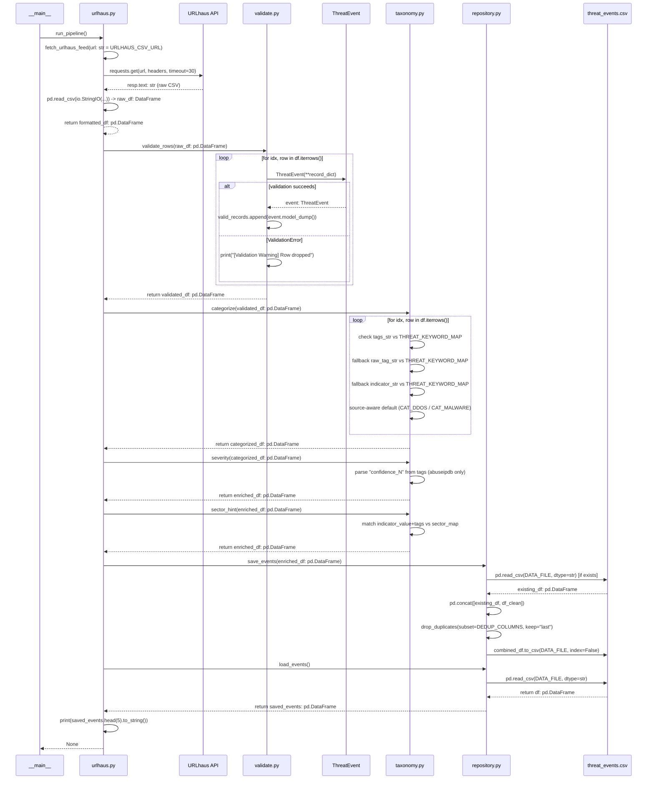

## 1. Detailed Class & Data Structure Diagram

```mermaid
classDiagram
    class ThreatEvent {
        +str event_id
        +str source
        +datetime date_added
        +Literal["url","ip"] indicator_type
        +str indicator_value
        +str raw_threat_tag
        +str tags
        +str country_code
        +Literal["online","offline","reported"] status
    }

    class validate_module {
        <<processing/validate.py>>
        +validate_rows(df: pd.DataFrame) pd.DataFrame
    }

    class taxonomy_module {
        <<processing/taxonomy.py>>
        +CAT_PHISHING: str
        +CAT_MALWARE: str
        +CAT_WEB_ATTACK: str
        +CAT_DDOS: str
        +THREAT_KEYWORD_MAP: dict
        +categorize_text(text: str) str
        +categorize(df: pd.DataFrame) pd.DataFrame
        +severity(df: pd.DataFrame) pd.DataFrame
        +sector_hint(df: pd.DataFrame) pd.DataFrame
        +classify_threat(threat_type: str, tags: str, url: str) str
        +enrich_with_taxonomy(df: pd.DataFrame) pd.DataFrame
    }

    class repository_module {
        <<storage/repository.py>>
        +BASE_DIR: Path
        +DATA_DIR: Path
        +DATA_FILE: Path
        +STANDARD_COLUMNS: list[str]
        +DEDUP_COLUMNS: list[str]
        +save_events(df: pd.DataFrame) None
        +load_events() pd.DataFrame
    }

    class urlhaus_collector {
        <<collectors/urlhaus.py>>
        +URLHAUS_CSV_URL: str
        +fetch_urlhaus_feed(url: str) pd.DataFrame
        +run_pipeline() None
    }

    class abuseipdb_collector {
        <<collectors/abuseipdb.py>>
        +ABUSEIPDB_API_URL: str
        +BASE_DIR: Path
        +fetch_abuseipdb_feed(limit: int) pd.DataFrame
        +run_pipeline() None
    }

    class phishtank_stub {
        <<collectors/phishtank.py>>
        stub - Jalon 2+
    }
    class nvd_stub {
        <<collectors/nvd.py>>
        stub - Jalon 2+
    }
    class dgssi_stub {
        <<collectors/dgssi.py>>
        stub - Jalon 2+
    }

    class stats_stub {
        <<analytics/stats.py>>
        stub - Jalon 2
    }
    class correlate_stub {
        <<analytics/correlate.py>>
        stub - Jalon 3+
    }
    class anomaly_stub {
        <<analytics/ml/anomaly.py>>
        stub - post-jalons
    }
    class classifier_stub {
        <<analytics/ml/classifier.py>>
        stub - post-jalons
    }

    class app_stub {
        <<app.py>>
        stub - Jalon 3
    }
    class rapport_pilote_stub {
        <<reporting/rapport_pilote.py>>
        stub - Jalon 3
    }
    class build_notebook_script {
        <<scripts/build_notebook.py>>
        +nb: NotebookNode
    }

    urlhaus_collector ..> validate_module : calls validate_rows()
    abuseipdb_collector ..> validate_module : calls validate_rows()
    validate_module ..> ThreatEvent : instantiates
    urlhaus_collector ..> taxonomy_module : calls categorize(), severity(), sector_hint()
    abuseipdb_collector ..> taxonomy_module : calls categorize(), severity(), sector_hint()
    urlhaus_collector ..> repository_module : calls save_events(), load_events()
    abuseipdb_collector ..> repository_module : calls save_events(), load_events()
    repository_module ..> ThreatEvent : DataFrame conforms to STANDARD_COLUMNS

    stats_stub ..> repository_module : will call load_events()
    correlate_stub ..> repository_module : will call load_events()
    app_stub ..> repository_module : will call load_events()
    rapport_pilote_stub ..> repository_module : will call load_events()
    build_notebook_script ..> repository_module : generated notebook calls load_events()
```

`ThreatEvent` is the sole Pydantic model in the codebase and is only instantiated inside `validate_rows()`, meaning every collector's output must pass through `processing/validate.py` before touching `storage/repository.py`. All other "classes" here are actually flat function modules (no OOP classes exist in this repo), shown with `<<stereotype>>` tags to reflect their real module-level structure.

## 2. Function-Level Call Sequence Diagram

The trace shows exact parameter types flowing between calls — raw `resp.text` strings become `pd.DataFrame` objects that are progressively mutated in place through `.copy()` calls inside `validate_rows()`, `categorize()`, `severity()`, and `sector_hint()`. Note `save_events()` returns `None` (write-only), which is why `urlhaus.py` immediately calls `load_events()` afterward just to print a preview.

## 3. Function Call & Module Structure Graph

```mermaid
flowchart TD
    subgraph COLLECTORS["collectors/"]
        UH_FETCH["urlhaus.py::fetch_urlhaus_feed(url)"]
        UH_RUN["urlhaus.py::run_pipeline()"]
        AB_FETCH["abuseipdb.py::fetch_abuseipdb_feed(limit)"]
        AB_RUN["abuseipdb.py::run_pipeline()"]
        PT_STUB["phishtank.py [stub]"]
        NVD_STUB["nvd.py [stub]"]
        DGSSI_STUB["dgssi.py [stub]"]
    end

    subgraph PROCESSING["processing/"]
        VAL_ROWS["validate.py::validate_rows(df)"]
        TE_MODEL["validate.py::ThreatEvent(**kwargs)"]
        TAX_CATTEXT["taxonomy.py::categorize_text(text)"]
        TAX_CAT["taxonomy.py::categorize(df)"]
        TAX_SEV["taxonomy.py::severity(df)"]
        TAX_SEC["taxonomy.py::sector_hint(df)"]
        TAX_CLASSIFY["taxonomy.py::classify_threat(threat_type, tags, url)"]
        TAX_ENRICH["taxonomy.py::enrich_with_taxonomy(df)"]
    end

    subgraph STORAGE["storage/"]
        REPO_SAVE["repository.py::save_events(df)"]
        REPO_LOAD["repository.py::load_events()"]
    end

    subgraph ANALYTICS["analytics/ [stub]"]
        STATS_STUB["stats.py [stub]"]
        CORR_STUB["correlate.py [stub]"]
        ANOM_STUB["ml/anomaly.py [stub]"]
        CLASS_STUB["ml/classifier.py [stub]"]
    end

    subgraph REPORTING["reporting/ + app.py [stub]"]
        APP_STUB["app.py [stub]"]
        RAPPORT_STUB["rapport_pilote.py [stub]"]
    end

    subgraph SCRIPTS["scripts/"]
        BUILD_NB["build_notebook.py (module-level script)"]
    end

    subgraph TESTS["tests/"]
        T_REPO["test_repository.py::test_save_events_creates_file_with_correct_header()"]
        T_DEDUP["test_repository.py::test_save_events_deduplication()"]
        T_MISSING["test_repository.py::test_load_events_on_missing_file()"]
        T_TAX_PHISH["test_taxonomy.py::test_row_with_phishing_tag_categorizes_as_phishing()"]
        T_TAX_URL["test_taxonomy.py::test_urlhaus_row_no_keyword_match_defaults_to_ransomware_malware()"]
        T_TAX_AB["test_taxonomy.py::test_abuseipdb_row_no_keyword_match_defaults_to_ddos_extortion()"]
        T_VAL_OK["test_validate.py::test_well_formed_row_passes_validation()"]
        T_VAL_DROP["test_validate.py::test_row_missing_indicator_value_is_dropped()"]
        T_VAL_EMPTY["test_validate.py::test_validate_rows_on_empty_dataframe()"]
    end

    UH_RUN --> UH_FETCH
    UH_FETCH -->|"raw_df"| UH_RUN
    UH_RUN --> VAL_ROWS
    VAL_ROWS --> TE_MODEL
    TE_MODEL -->|"event.model_dump()"| VAL_ROWS
    VAL_ROWS -->|"validated_df"| UH_RUN
    UH_RUN --> TAX_CAT
    TAX_CAT -->|"categorized_df"| UH_RUN
    UH_RUN --> TAX_SEV
    TAX_SEV -->|"enriched_df"| UH_RUN
    UH_RUN --> TAX_SEC
    TAX_SEC -->|"enriched_df"| UH_RUN
    UH_RUN --> REPO_SAVE
    UH_RUN --> REPO_LOAD
    REPO_LOAD -->|"saved_events"| UH_RUN

    AB_RUN --> AB_FETCH
    AB_FETCH -->|"raw_df"| AB_RUN
    AB_RUN --> VAL_ROWS
    AB_RUN --> TAX_CAT
    AB_RUN --> TAX_SEV
    AB_RUN --> TAX_SEC
    AB_RUN --> REPO_SAVE
    AB_RUN --> REPO_LOAD

    REPO_SAVE -->|"writes"| REPO_LOAD

    TAX_CLASSIFY -.->|"delegates to"| TAX_CATTEXT
    TAX_ENRICH -.->|"calls"| TAX_CAT
    TAX_ENRICH -.->|"calls"| TAX_SEV

    REPO_LOAD -.->|"future: full dataset"| STATS_STUB
    REPO_LOAD -.->|"future: full dataset"| CORR_STUB
    REPO_LOAD -.->|"future"| ANOM_STUB
    REPO_LOAD -.->|"future"| CLASS_STUB
    REPO_LOAD -.->|"future"| APP_STUB
    REPO_LOAD -.->|"future"| RAPPORT_STUB
    REPO_LOAD -.->|"used by generated notebook"| BUILD_NB

    T_REPO -.->|"tests"| REPO_SAVE
    T_DEDUP -.->|"tests"| REPO_SAVE
    T_MISSING -.->|"tests"| REPO_LOAD
    T_TAX_PHISH -.->|"tests"| TAX_CAT
    T_TAX_URL -.->|"tests"| TAX_CAT
    T_TAX_AB -.->|"tests"| TAX_CAT
    T_VAL_OK -.->|"tests"| TE_MODEL
    T_VAL_DROP -.->|"tests"| VAL_ROWS
    T_VAL_EMPTY -.->|"tests"| VAL_ROWS

    PT_STUB -.->|"Jalon 2+"| VAL_ROWS
    NVD_STUB -.->|"Jalon 2+"| VAL_ROWS
    DGSSI_STUB -.->|"Jalon 2+"| VAL_ROWS
```

Both `run_pipeline()` functions in `urlhaus.py` and `abuseipdb.py` call the exact same four downstream functions in identical order (`validate_rows` → `categorize` → `severity` → `sector_hint` → `save_events`/`load_events`), which is why the two collector subtrees converge onto shared `processing/` and `storage/` nodes rather than duplicating logic. Test files are wired in with dashed edges to show which specific functions each unit test exercises, confirming the 9/9 passing tests map cleanly onto `repository.py`, `taxonomy.py`, and `validate.py`.