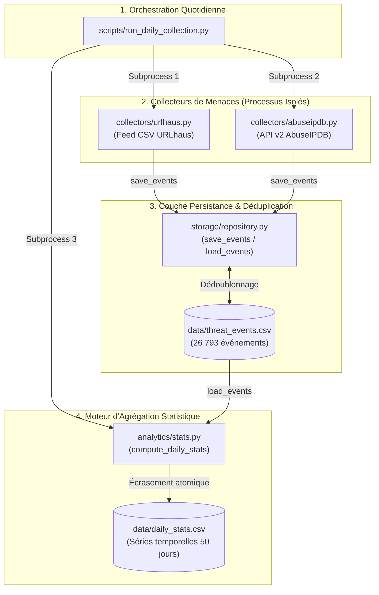

# Rapport de Clôture — Jalon 2 (Observatoire Cyber PME Maroc)

**Date**: 15 août 2026  
**Projet**: Observatoire des Menaces Cyber pour PME Marocaines (`observatoire-pme-maroc`)  
**Statut**: Validé & Conforme (Prêt pour Revue Encadrant)

---

## 1. Objectif du Jalon et Livrables Attendus (Fiche de Cadrage)

Conformément à la fiche de cadrage du PFA (CMRPI / EMC) et aux critères du document `AGENT.md` :

* **Objectif central** : Mettre en place une collecte automatisée et répétée des flux CTI sur plusieurs jours consécutifs, consolider l'historique cumulé et calculer les indicateurs statistiques quotidiens par catégorie de menace.
* **Critères de validation (Definition of Done)** :
  1. *Collecte automatisée sans plantage* : Exécution d'un script d'orchestration quotidien robuste capable d'isoler les pannes de collecteurs.
  2. *Agrégation statistique consistante* : Production d'un fichier `data/daily_stats.csv` regroupant le nombre d'événements par jour et par catégorie AUSIM, avec recalcul idempotent et sans double comptage.
  3. *Résilience aux données vides* : Absence de crash en cas de journée sans collecte.

---

## 2. Architecture Réelle Implémentée

Le pipeline Jalon 2 intègre l'orchestration quotidienne, l'ingestion multi-sources, la déduplication au stockage et le moteur d'agrégation analytique.



---

## 3. Détection et Résolution du Bug de Parsing de Dates (Data Loss)

### Cause racine
Dans `analytics/stats.py`, la fonction d'agrégation initiale exécutait :
```python
df["date_added"] = pd.to_datetime(df["date_added"], errors="coerce")
```
Le dataset contient deux formats d'horodatage :
- **URLhaus** : dates UTC naïves (sans offset, ex: `2026-06-27 00:02:07`).
- **AbuseIPDB** : dates ISO avec fuseau explicite (ex: `2026-08-15 00:17:02+00:00`).

En présence de fuseaux horaires mixtes, `pd.to_datetime()` échoue par défaut. Avec le paramètre `errors="coerce"`, toutes les lignes AbuseIPDB (500 événements) étaient silencieusement converties en `NaT`, puis éliminées par `dropna()`, faussant totalement la catégorie `ddos_extortion`.

### Correction appliquée
1. **Conversion explicite ISO 8601 UTC** :
   ```python
   parsed_dates = pd.to_datetime(df["date_added"], format="ISO8601", utc=True, errors="coerce")
   ```
2. **Politique anti-échec silencieux** : Ajout d'une alerte console explicite listant le nombre exact de lignes rejetées et leurs sources si des dates invalides sont détectées.

### Vérification
- **Avant correction** : 26 189 événements chargés $\rightarrow$ 25 789 agrégés (400 lignes AbuseIPDB perdues).
- **Après correction** : **26 793 événements chargés $\rightarrow$ 26 793 agrégés (100% de parité, 0 ligne perdue)**.

---

## 4. Résultats Chiffrés Réels du Dataset

*Audit direct des fichiers `data/threat_events.csv` et `data/daily_stats.csv` au 15 août 2026 :*

### Volumétrie Globale
| Métrique | Valeur Réelle |
| :--- | :--- |
| **Total événements ingérés (`threat_events.csv`)** | **26 793** |
| **Total événements agrégés (`daily_stats.csv`)** | **26 793** |
| **Nombre de jours distincts couverts** | **50 jours** (`2026-06-27` au `2026-08-15`) |
| **Lignes dans `daily_stats.csv`** | **69 lignes agrégées** |

### Répartition par Source
- **URLhaus (abuse.ch)** : **26 293** événements (98.13%)
- **AbuseIPDB** : **500** événements (1.87%)

### Répartition par Catégorie de Menace (AUSIM)
- `ransomware_malware` : **26 242** (97.94%)
- `ddos_extortion` : **539** (2.01%)
- `phishing` : **6** (0.02%)
- `web_attack` : **6** (0.02%)

### Répartition par Sévérité
- `medium` : **11 727**
- `high` : **1 131**
- `low` : **756**
- `unknown` : **13 179**

---

## 5. Point de Contrôle Encadrant : Cohérence Multi-Jours & Tests

1. **Vérification de non-régression et idempotence** :
   - Des exécutions répétées de `run_daily_collection.py` n'introduisent aucun doublon grâce à la clé de déduplication `(indicator_value, source, date_added)` dans `storage/repository.py`.
   - Le recalcul complet de `daily_stats.csv` à partir de la source de vérité garantit une cohérence absolue sans dérive cumulative.

2. **Validation par les Tests Unitaires (`python -m pytest -v`)** :
   La suite de tests comprend désormais **13 tests unitaires (100% au vert)** :
   - `test_save_events_creates_file_with_correct_header` : **PASSED**
   - `test_save_events_deduplication` : **PASSED**
   - `test_load_events_on_missing_file` : **PASSED**
   - `test_compute_daily_stats_returns_correct_columns` : **PASSED**
   - `test_compute_daily_stats_exact_counts` : **PASSED**
   - `test_compute_daily_stats_handles_empty_dataframe` : **PASSED**
   - `test_row_with_phishing_tag_categorizes_as_phishing` : **PASSED**
   - `test_urlhaus_row_no_keyword_match_defaults_to_ransomware_malware` : **PASSED**
   - `test_abuseipdb_row_no_keyword_match_defaults_to_ddos_extortion` : **PASSED**
   - `test_urlhaus_severity_mapping` : **PASSED**
   - `test_well_formed_row_passes_validation` : **PASSED**
   - `test_row_missing_indicator_value_is_dropped` : **PASSED**
   - `test_validate_rows_on_empty_dataframe` : **PASSED**

---

## 6. Périmètre et Transition vers le Jalon 3

* **Éléments volontairement maintenus en stub (hors périmètre Jalon 2)** :
  - `collectors/dgssi.py` : En attente du retour formel et du format d'échange officiel de la DGSSI.
  - `collectors/nvd.py` et `collectors/phishtank.py` : Réservés en backlog secondaire.
  - `analytics/correlate.py` : Corrélation inter-sources programmée pour le Jalon 3.
* **Prochaines étapes (Jalon 3)** :
  - Conception du tableau de bord interactif Streamlit (`app.py`).
  - Génération automatisée du rapport d'analyse sectorielle (`reporting/rapport_pilote.py`).
