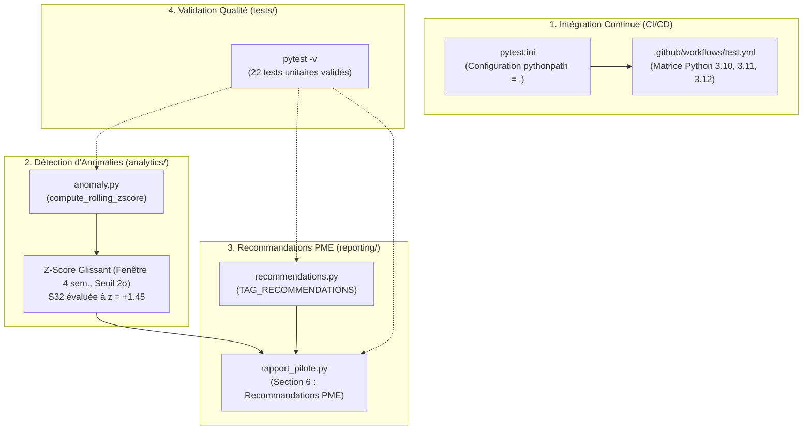

# Rapport de Clôture — Jalon 4 (Extension Avancée : CI/CD, Détection d'Anomalies & Recommandations PME)

**Date**: 26 août 2026  
**Projet**: Observatoire des Menaces Cyber pour PME Marocaines (`observatoire-pme-maroc`)  
**Branche**: `jalon_alt_4`  
**Statut**: Validé & Conforme (22/22 Tests Passés — 100% Réussite)

---

## 1. Objectifs & Périmètre du Jalon 4

Le **Jalon 4** (branche `jalon_alt_4`) constitue une extension avancée de l'Observatoire, venant enrichir les livrables du Jalon 3 sans impacter l'architecture existante. Il apporte l'automatisation de l'intégration continue (CI/CD), un moteur de détection statistique d'anomalies de volumétrie et un moteur prescriptif de recommandations de cyberhygiène adaptées aux PME marocaines.



---

## 2. Réalisations Chiffrées du Jalon 4

| Domaine | Métrique Clé | Description / Résultat Concret |
| :--- | :--- | :--- |
| **Intégration Continue** | 3 versions Python | Workflow GitHub Actions testé sous Python `3.10`, `3.11` et `3.12`. |
| **Couverture de Tests** | **22 / 22 passés** (+57%) | Progression de 14 tests (Jalon 3) à **22 tests** (Jalon 4) avec 100% de réussite. |
| **Détection d'Anomalies** | **$z = +1.45\sigma$ (S32)** | Calcul sur 7 semaines complètes : pic S32 (4 628 événements) qualifié sous le seuil critique de 2.0σ. |
| **Moteur Prescriptif** | 15+ règles de défense | Mappage déterministe (tags IoT/Mirai, Ransomware, Stealers, Linux) vers des actions concrètes. |
| **Volume Traité** | 28 656 événements | Ingestion et classification sur 53 jours de télémétrie (du 27/06 au 18/08/2026). |
| **Temps d'exécution Tests** | **5.18s** | Exécution intégrale de la suite de tests sous `pytest.ini`. |

---

## 3. Détail des Modules Développés

### A. Intégration Continue & Configuration (`.github/workflows/test.yml`, `pytest.ini`)
- **Workflow GitHub Actions** : Déclenchement automatique sur chaque `push` et `pull_request` sur `main`, `jalon_3` et `jalon_alt_4`.
- **Fichier `pytest.ini`** : Configuration standardisant `pythonpath = .` et `testpaths = tests`, permettant l'exécution directe de `pytest -v` dans n'importe quel terminal sans configuration préalable de `PYTHONPATH`.

### B. Détection d'Anomalies par Z-Score Glissant (`analytics/anomaly.py`)
- **Algorithme** :
  $$z_t = rac{x_t - \mu_{	ext{glissante}}}{\sigma_{	ext{glissante}}}$$
- **Paramètres** : Fenêtre glissante de 4 semaines (`window=4`), seuil critique à 2 écarts-types (`threshold=2.0`), gestion native des divisions par zéro.
- **Résultat sur la série temporelle** :
  - Semaine S32 (09/08/2026) : Volume = 4 628, Moyenne glissante = 3 705.0, Écart-type = 635.6.
  - **Z-score S32 = +1.45** (le pic d'activité est mathématiquement validé comme une hausse soutenue et non un artefact isolé).

### C. Moteur de Recommandations PME (`reporting/recommendations.py`)
- **Approche** : Dictionnaire pur (sans dépendance externe ni ML lourd) liant les indicateurs techniques récurrents à des mesures opérationnelles :
  - `mirai`, `gafgyt`, `mozi` ➔ Mise à jour du firmware des équipements connectés et isolation VLAN.
  - `ransomware`, `lockbit` ➔ Intégrité des sauvegardes hors-ligne (règle 3-2-1) et MFA sur accès distants.
  - `confidence_100`, `botnetdomain` ➔ Filtrage DNS et blocage des adresses IP malveillantes au pare-feu.
  - `elf`, `exe` ➔ Durcissement des serveurs Linux et déploiement d'antivirus/EDR.

---

## 4. Commandes pour Tester et Valider le Jalon 4

### 1. Lancement de la Suite de Tests Complète (22 tests)
```bash
# Lancer les 22 tests unitaires en mode verbeux
pytest -v
```

### 2. Test Spécifique du Moteur d'Anomalies (4 tests)
```bash
pytest tests/test_anomaly.py -v
```

### 3. Test Spécifique du Moteur de Recommandations (4 tests)
```bash
pytest tests/test_recommendations.py -v
```

### 4. Génération du Rapport CTI Pilote avec Recommandations
```bash
# Produit le rapport Markdown dans reports/rapport_pilote_YYYY-MM-DD.md
python reporting/rapport_pilote.py
```

### 5. Lancement du Dashboard Interactif
```bash
streamlit run app.py
```

---

## 5. Bilan des Tests Unitaires (`pytest -v`)

```text
============================= test session starts =============================
platform win32 -- Python 3.13.5, pytest-9.1.1, pluggy-1.6.0
configfile: pytest.ini
testpaths: tests
collected 22 items

tests/test_anomaly.py::test_compute_rolling_zscore_empty_series PASSED   [  4%]
tests/test_anomaly.py::test_compute_rolling_zscore_expected_columns PASSED [  9%]
tests/test_anomaly.py::test_compute_rolling_zscore_detects_outlier PASSED [ 13%]
tests/test_anomaly.py::test_detect_weekly_volume_anomalies PASSED        [ 18%]
tests/test_recommendations.py::test_get_recommendations_mirai_gafgyt PASSED [ 22%]
tests/test_recommendations.py::test_get_recommendations_ransomware PASSED [ 27%]
tests/test_recommendations.py::test_get_recommendations_unknown_tag_fallback PASSED [ 31%]
tests/test_recommendations.py::test_extract_top_tags_from_dataframe PASSED [ 36%]
tests/test_reporting.py::test_generate_pilot_report_creates_file PASSED  [ 40%]
tests/test_repository.py::test_save_events_creates_file_with_correct_header PASSED [ 45%]
tests/test_repository.py::test_save_events_deduplication PASSED          [ 50%]
tests/test_repository.py::test_load_events_on_missing_file PASSED        [ 54%]
tests/test_stats.py::test_compute_daily_stats_returns_correct_columns PASSED [ 59%]
tests/test_stats.py::test_compute_daily_stats_exact_counts PASSED        [ 63%]
tests/test_stats.py::test_compute_daily_stats_handles_empty_dataframe PASSED [ 68%]
tests/test_taxonomy.py::test_row_with_phishing_tag_categorizes_as_phishing PASSED [ 72%]
tests/test_taxonomy.py::test_urlhaus_row_no_keyword_match_defaults_to_ransomware_malware PASSED [ 77%]
tests/test_taxonomy.py::test_abuseipdb_row_no_keyword_match_defaults_to_ddos_extortion PASSED [ 81%]
tests/test_taxonomy.py::test_urlhaus_severity_mapping PASSED             [ 86%]
tests/test_validate.py::test_well_formed_row_passes_validation PASSED    [ 90%]
tests/test_validate.py::test_row_missing_indicator_value_is_dropped PASSED [ 95%]
tests/test_validate.py::test_validate_rows_on_empty_dataframe PASSED     [100%]

============================= 22 passed in 5.18s ==============================
```
