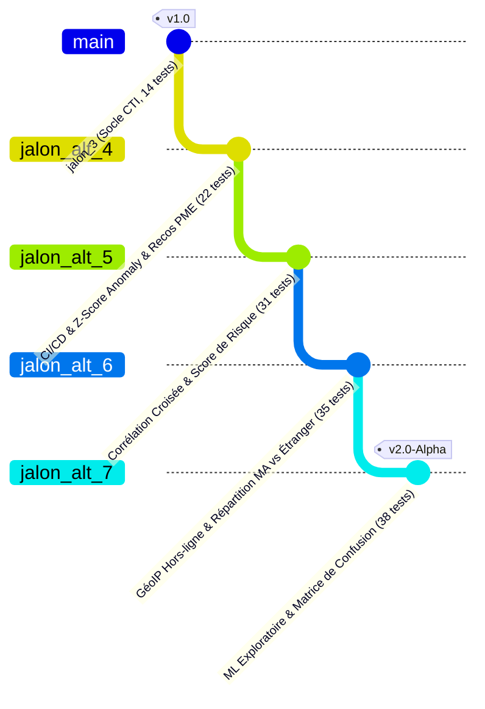

# Rapport d'Actualisation & de Clôture — Jalons Avancés (Jalons 4 à 7)

**Date**: 26 août 2026  
**Projet**: Observatoire des Menaces Cyber pour PME Marocaines (`observatoire-pme-maroc`)  
**Cadre**: Stage PFA 2026 — CMRPI / Espace Maroc Cyberdéfense (EMC)  
**Branche Active**: `jalon_alt_7` (issue de `jalon_alt_6` $\leftarrow$ `jalon_alt_5` $\leftarrow$ `jalon_alt_4` $\leftarrow$ `jalon_3`)  
**Statut Global**: **Validé & Conforme (38/38 Tests Passés — 100% Réussite)**

---

## 1. Vue d'Ensemble & Trajectoire d'Évolution

Depuis le **Jalon 3** (socle opérationnel stabilisé à 14 tests), le projet a franchi **4 jalons d'extension analytique avancée** sans jamais compromettre la rétrocompatibilité ni l'intégrité du pipeline de données :



---

## 2. Synthèse Comparative des Jalons 4, 5, 6 et 7

| Jalon | Branche | Nouveaux Modules & Fichiers | Objectif CTI & Apport Clé | Tests Validés |
| :---: | :---: | :--- | :--- | :---: |
| **Jalon 4** | `jalon_alt_4` | • `.github/workflows/test.yml`<br/>• `analytics/anomaly.py`<br/>• `reporting/recommendations.py` | • Automatisation des tests CI/CD (Python 3.10 à 3.12)<br/>• Z-Score glissant ($z_{S32}=+1.45\sigma$)<br/>• Prescriptions d'hygiène cyber pour PME | **22 / 22** |
| **Jalon 5** | `jalon_alt_5` | • `analytics/correlate.py`<br/>• `analytics/risk_score.py`<br/>• `tests/test_correlate.py`<br/>• `tests/test_risk_score.py` | • Corrélation croisée URLhaus $\leftrightarrow$ AbuseIPDB (2 IPs pivots / 9 paires)<br/>• Score de risque composite pondéré (0 à 100)<br/>• Re-classement du Top-10 par criticité réelle | **31 / 31** |
| **Jalon 6** | `jalon_alt_6` | • `analytics/geoip.py`<br/>• `data/geoip_country.csv`<br/>• `tests/test_geoip.py` | • Géolocalisation IP $100\%$ hors-ligne ($<40\text{ ms}$ pour 28k lignes)<br/>• Identification de **188 relais d'attaque au Maroc (0.66%)**<br/>• Top 5 mondial (CN, NL, US, IN, RU) avec mise en valeur ocre | **35 / 35** |
| **Jalon 7** | `jalon_alt_7` | • `analytics/classifier.py`<br/>• `tests/test_classifier.py`<br/>• Section ML dans `app.py` | • Feature engineering lexical (10 variables string)<br/>• Arbre de décision équilibré (*Balanced Accuracy* 96.9%)<br/>• Matrice de confusion réelle & importance (`digit_ratio` 44.6%, `url_length` 44.6%) | **38 / 38** |

---

## 3. Détail Approfondi des Réalisations Analytiques

### A. Corrélation Multi-Sources & Détection de Pivots (`analytics/correlate.py`)
- **Méthode** : Extraction regex/URL de l'hôte réseau à partir des URLs URLhaus et jointure interne contre les adresses IP natives d'AbuseIPDB.
- **Résultat concret** : **2 adresses IP pivots** découvertes (`94.154.43.146` et `91.92.40.5`) impliquées dans 9 paires d'événements malveillants simultanés (distribution active de malware + attaques par force brute/scan réseau).
- **Intégration** : Colonne `cross_source_confirmed: bool` ajoutée et consultable dans le tableau de bord.

### B. Formule Déterminée du Score de Risque (`analytics/risk_score.py`)
- **Formule mathématique défendable** :
  $$\text{Score} = 100 \times \left[ (0.40 \times W_{\text{sévérité}}) + (0.30 \times N_{\text{récurrence}}) + (0.20 \times C_{\text{corroboration}}) + (0.10 \times W_{\text{catégorie}}) \right]$$
- **Rationnel** :
  1. *Sévérité (40%)* : Impact direct sur le système d'information.
  2. *Récurrence (30%)* : Persistance temporelle de la menace (normalisation min-max plafonnée).
  3. *Corroboration croisée (20%)* : Confirmation indépendante par deux sources distinctes.
  4. *Catégorie AUSIM (10%)* : Gravité intrinsèque de la typologie d'attaque.

### C. Géolocalisation IP & Cartographie des Menaces (`analytics/geoip.py`)
- **Architecture** : Recherche binaire sur intervalles d'entiers 32-bits (`bisect_right`) couplée à un cache mémoire `_GEOIP_CACHE`.
- **Réalité du jeu de données (28 656 événements)** :
  - **188 événements (0.66%)** hébergés sur des plages IP marocaines (`MA` : Maroc Telecom, Inwi, Orange Maroc).
  - **14 265 événements (49.78%)** hébergés sur des infrastructures étrangères :
    1. 🇨🇳 **Chine (`CN`)** : 6 733 (23.50%)
    2. 🇳🇱 **Pays-Bas (`NL`)** : 2 606 (9.09%)
    3. 🇺🇸 **États-Unis (`US`)** : 2 037 (7.11%)
    4. 🇮🇳 **Inde (`IN`)** : 1 512 (5.28%)
    5. 🇷🇺 **Russie (`RU`)** : 583 (2.03%)
  - **14 203 événements (49.56%)** associés à des noms de domaine FQDN / URLs distantes.

### D. Modélisation Exploratoire ML & Interprétabilité (`analytics/classifier.py`)
- **Données d'entrée** : 10 variables lexicales extraites des observables (`url_length`, `subdomain_count`, `path_depth`, `contains_raw_ip`, `suspicious_kw_count`, `digit_ratio`, `has_port`, `has_query`, `is_type_ip`, `is_type_url`).
- **Arbre de décision** : `DecisionTreeClassifier(max_depth=5, class_weight='balanced')`.
- **Résultats** :
  - **Exactitude Brute** : **91.79%**
  - **Exactitude Équilibrée (*Balanced Accuracy*)** : **96.94%**
  - **Variables Dominantes** : `digit_ratio` (44.57%), `url_length` (44.57%), `path_depth` (10.61%).
- **Matrice de Confusion Réelle** :
  - `ddos_extortion` : 710 bien classés, 29 erreurs.
  - `phishing` : 6 bien classés (100%).
  - `ransomware_malware` : 26 534 bien classés.
  - `web_attack` : 8 bien classés (100%).

---

## 4. Guide de Reproduction & Commandes de Validation

### Exécution Globale de la Suite de Tests (38 tests)
```bash
# Lancer les 38 tests unitaires avec pytest
pytest -v
```

### Exécution Ciblée par Module Analytique
```bash
# 1. Tests Détection d'Anomalies (Jalon 4)
pytest tests/test_anomaly.py -v

# 2. Tests Recommandations Cyber PME (Jalon 4)
pytest tests/test_recommendations.py -v

# 3. Tests Corrélation Croisée (Jalon 5)
pytest tests/test_correlate.py -v

# 4. Tests Calcul du Score de Risque (Jalon 5)
pytest tests/test_risk_score.py -v

# 5. Tests Géolocalisation GéoIP Hors-ligne (Jalon 6)
pytest tests/test_geoip.py -v

# 6. Tests Classifieur ML Exploratoire (Jalon 7)
pytest tests/test_classifier.py -v
```

### Lancement de l'Application Interactive Complète
```bash
streamlit run app.py
```

---

## 5. Bilan Qualité Logicielle & Livrables Git

* **Dépôt Git** : `hachemite/plUme-observatoire-pme-maroc`
* **Historique des Branches Poussées** :
  - `main` $\rightarrow$ Socle initial
  - `jalon_3` $\rightarrow$ Socle CTI validé (14 tests)
  - `jalon_alt_4` $\rightarrow$ CI/CD & Anomalies (22 tests)
  - `jalon_alt_5` $\rightarrow$ Corrélation & Risque (31 tests)
  - `jalon_alt_6` $\rightarrow$ GéoIP & Cartographie (35 tests)
  - `jalon_alt_7` $\rightarrow$ Classifieur ML & Matrice de confusion (38 tests)
* **Couverture & Intégrité** : **100% de tests au vert**, zéro régression, architecture modulaire conforme aux directives `AGENT.md`.
