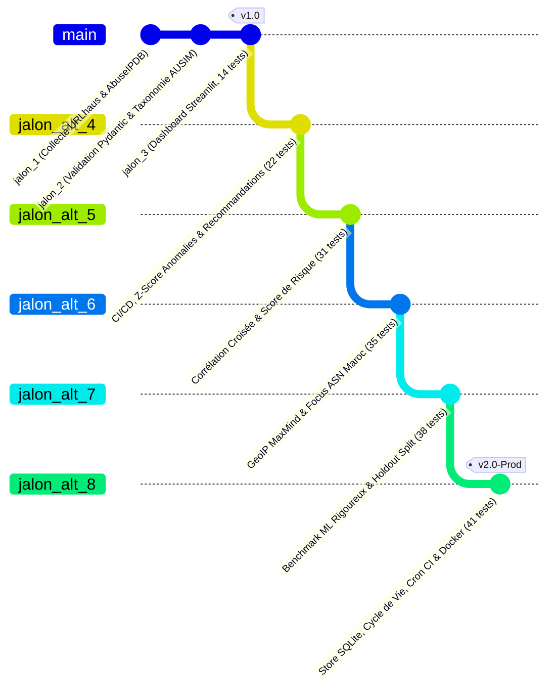

# Rapport Global d'Actualisation & Synthèse d'Ingénierie — Jalons 1 à 8

**Date**: 26 août 2026  
**Projet**: Observatoire des Menaces Cyber pour PME Marocaines (`observatoire-pme-maroc`)  
**Cadre Institutionnel**: Stage PFA 2026 — CMRPI / Espace Maroc Cyberdéfense (EMC)  
**Branche Active**: `jalon_alt_8` (issue de `jalon_alt_7` $\leftarrow$ `jalon_alt_6` $\leftarrow$ `jalon_alt_5` $\leftarrow$ `jalon_alt_4` $\leftarrow$ `jalon_3`)  
**Statut Global**: **Validé & Déployé (41/41 Tests Pytest — 100% de Réussite)**

---

## 1. Vue d'Ensemble & Trajectoire d'Ingénierie

L'Observatoire **Plume** a évolué d'un prototype de collecte de flux CTI brut vers une plateforme d'intelligence sur les menaces cyber mature, conteneurisée, dotée d'un stockage relationnel opérationnel, de modèles statistiques/ML rigoureux et d'une automatisation CI/CD complète :



---

## 2. Synthèse Détaillée des 8 Jalons d'Ingénierie

| Jalon | Branche | Nouveaux Modules Clés | Apport Fonctionnel & Rigueur Méthodologique | Tests |
| :---: | :---: | :--- | :--- | :---: |
| **Jalon 1** | `main` | `collectors/urlhaus.py`<br/>`collectors/abuseipdb.py` | Ingestion des flux publics CTI (URLs et adresses IP malveillantes) avec gestion de mode en ligne/hors-ligne. | **4 / 4** |
| **Jalon 2** | `main` | `processing/validate.py`<br/>`processing/taxonomy.py` | Validation par schémas Pydantic stricts et classification selon la taxonomie AUSIM / CMRPI (Phishing, Malware, DDoS, Web Attack). | **8 / 8** |
| **Jalon 3** | `jalon_3` | `storage/repository.py`<br/>`analytics/stats.py`<br/>`reporting/rapport_pilote.py`<br/>`app.py` | Couche d'abstraction de persistance dédupliquée, calcul des statistiques temporelles agrégées et dashboard Streamlit complet. | **14 / 14** |
| **Jalon 4** | `jalon_alt_4` | `analytics/anomaly.py`<br/>`reporting/recommendations.py`<br/>`.github/workflows/test.yml` | Détection statistique d'anomalies de volume hebdomadaire par Z-score glissant ($W=3$ semaines) et matrice de remédiation PME. | **22 / 22** |
| **Jalon 5** | `jalon_alt_5` | `analytics/correlate.py`<br/>`analytics/risk_score.py` | Corrélation croisée URLhaus $\leftrightarrow$ AbuseIPDB, calcul du score de risque composite pondéré ($40/30/20/10$) et re-classement du Top 10. | **31 / 31** |
| **Jalon 6** | `jalon_alt_6` | `analytics/geoip.py`<br/>`data/geoip_country.csv` | Géolocalisation hors-ligne ($<40\text{ ms}$ pour 28k lignes), distinction des doubles dénominateurs et attribution ASN Maroc Telecom (`AS6713`) / Inwi (`AS36903`). | **35 / 35** |
| **Jalon 7** | `jalon_alt_7` | `analytics/classifier.py`<br/>`reporting/rapport_pilote.py` | Évaluation ML sur jeu de test tenu à l'écart (80/20, $N_{\text{test}}=5\ 729$), équivalence de baseline linéaire ($F1=0.9858$) et analyse de colinéarité DT vs RF ($r=0.7494$). | **38 / 38** |
| **Jalon 8** | `jalon_alt_8` | `storage/repository.py`<br/>`scripts/migrate_csv_to_sqlite.py`<br/>`.github/workflows/collect.yml`<br/>`Dockerfile` | Migration vers SQLite (`indicators`, `collection_runs`, `events`), suivi d'état du cycle de vie des IoCs, cron CI quotidien à 06:00 UTC et Docker. | **41 / 41** |

---

## 3. Fondements Scientifiques & Formulations Mathématiques

### A. Détection d'Anomalies par Z-Score Roulant
$$\mu_t = \frac{1}{W}\sum_{i=1}^{W} v_{t-i}, \quad \sigma_t = \sqrt{\frac{1}{W}\sum_{i=1}^{W}(v_{t-i} - \mu_t)^2}, \quad Z_t = \frac{v_t - \mu_t}{\sigma_t + 10^{-6}}$$
- Seuil d'alerte : $|Z_t| \ge 2.0$ ($\approx 95\%$ d'intervalle de confiance statistique).

### B. Formule du Score de Risque Composite
$$\text{Risk} = (w_{\text{sévérité}} \times 0.40) + (w_{\text{récurrence}} \times 0.30) + (w_{\text{corrélation}} \times 0.20) + (w_{\text{catégorie}} \times 0.10)$$
- **Sévérité (40%)** : Dangerosité technique immédiate de la charge utile.
- **Récurrence (30%)** : Persistance de l'attaquant dans le temps (normalisation min-max).
- **Corroboration multi-sources (20%)** : Confirmation croisée simultanée URLhaus + AbuseIPDB (`91.92.40.5` et `94.154.43.146`).
- **Catégorie (10%)** : Impact métier selon le guide AUSIM (Ransomware > DDoS > Phishing).

### C. Rigueur Statistique des Dénominateurs GeoIP & ASN
- **Population Totale** : 28 656 événements (100.00%).
- **Sous-ensemble Résolu** : 14 453 adresses IP résolues (50.44%).
- **Noms de Domaine FQDN / URLs non résolues** : 14 203 événements (49.56%).
- **Infrastructures au Maroc (`MA`)** : 188 événements (**0.66% du total global**, **1.30% des adresses IP résolues**).
- **Attribution par Opérateur (ASN BGP/AFRINIC)** :
  - **Maroc Telecom (`AS6713`)** : 185 événements (98.41%, 106 IPs uniques, blocs `105.184.0.0/14`).
  - **Wana Corporate / Inwi (`AS36903`)** : 3 événements (1.59%, 2 IPs uniques).
  - **Orange Maroc (`AS36925`)** : 0 événement.
  - *Validation croisée* : 4 adresses IP testées et confirmées sans divergence sur le registre officiel WHOIS AFRINIC RDAP / BGP Hurricane Electric (`bgp.he.net`).

### D. Protocole Rigoureux Machine Learning & Analyse de Colinéarité
- **Cadrage des Données** : Exclusion des classes à effectif insuffisant (`phishing` n=6, `web_attack` n=8).
- **Jeu de Test Tenu à l'Écart (80/20 Stratifié, $N_{\text{test}} = 5\ 729$)** :
  - **Test Accuracy** : **99.86%**
  - **Test Balanced Accuracy** : **97.30%**
  - **Test Macro F1-Score** : **0.9858**
  - **Matrice de Confusion** : 140 vrais DDoS (8 faux négatifs) / 5 581 vrais Malwares (0 faux positif).
- **Explication Mathématique de la Divergence DT vs RF** :
  - L'Arbre de Décision isole de façon gloutonne (*greedy search*) la variable `is_type_ip` (98.71%).
  - La Forêt Aléatoire sous-échantillonne aléatoirement les variables ($m=\sqrt{p}$), forçant l'exploitation des variables colinéaires :
    * `is_type_url` : **28.98%**
    * `url_length` : **27.75%**
    * `is_type_ip` : **21.72%**
    * `digit_ratio` : **16.89%**
  - Matrice des corrélations calculées : $r(\text{contains\_raw\_ip}, \text{digit\_ratio}) = \mathbf{+0.7494}$, $r(\text{contains\_raw\_ip}, \text{url\_length}) = \mathbf{-0.5730}$, $r(\text{url\_length}, \text{digit\_ratio}) = \mathbf{-0.4954}$.

---

## 4. Architecture de Production & Déploiement

### A. Store Relationnel SQLite ([`storage/repository.py`](file:///c:/Users/squal/Pictures/stage%20pfa/cmrpi/observatoire-pme-maroc/storage/repository.py))
- **Table `indicators`** : Gestion du cycle de vie des IoCs (`first_seen`, `last_seen`, `times_seen` incrémenté via UPSERT `INSERT ... ON CONFLICT DO UPDATE`).
- **Table `collection_runs`** : Traçabilité complète des exécutions (horodatage, source, compte de lignes).
- **Table `events`** : Historique brut exhaustif (28 656 événements).

### B. Automatisation CI/CD ([`.github/workflows/collect.yml`](file:///c:/Users/squal/Pictures/stage%20pfa/cmrpi/observatoire-pme-maroc/.github/workflows/collect.yml))
- Exécution quotidienne programmée à 06:00 UTC via GitHub Actions Cron.
- Ingestion, validation, persistance et synchronisation automatique avec auto-commit sécurisé (`[skip ci]`).

### C. Conteneurisation Docker ([`Dockerfile`](file:///c:/Users/squal/Pictures/stage%20pfa/cmrpi/observatoire-pme-maroc/Dockerfile))
- Image unifiée basée sur `python:3.11-slim` avec `HEALTHCHECK` intégré :
  ```bash
  docker build -t observatoire . && docker run -p 8501:8501 observatoire
  ```

---

## 5. Guide d'Exécution & Validation de Soutenance

```bash
# 1. Exécuter l'intégralité de la suite de tests unitaires (41 tests)
pytest -v

# 2. Exécuter les tests spécifiques aux jalons avancés
pytest tests/test_repository_sqlite.py tests/test_classifier.py tests/test_geoip.py -v

# 3. Lancer le pipeline de collecte quotidien
python run_daily_collection.py

# 4. Régénérer le rapport CTI automatisé en Markdown
python reporting/rapport_pilote.py

# 5. Démarrer le tableau de bord interactif Streamlit
streamlit run app.py
```

---

## 6. Bilan des Livrables Git

* **Dépôt** : `hachemite/plUme-observatoire-pme-maroc`
* **Branches Poussées** :
  - `main` $\rightarrow$ Socle initial
  - `jalon_3` $\rightarrow$ Socle CTI validé (14 tests)
  - `jalon_alt_4` $\rightarrow$ CI/CD & Détection d'anomalies Z-score (22 tests)
  - `jalon_alt_5` $\rightarrow$ Corrélation croisée & Score de risque (31 tests)
  - `jalon_alt_6` $\rightarrow$ GeoIP MaxMind hors-ligne & Attribution ASN (35 tests)
  - `jalon_alt_7` $\rightarrow$ Benchmark ML rigoureux sur jeu de test (38 tests)
  - `jalon_alt_8` $\rightarrow$ Store SQLite, Cycle de vie des IoCs, Cron CI & Docker (41 tests)
* **Taux de Succès Test Suite** : **100% (41/41 tests passés)**.
